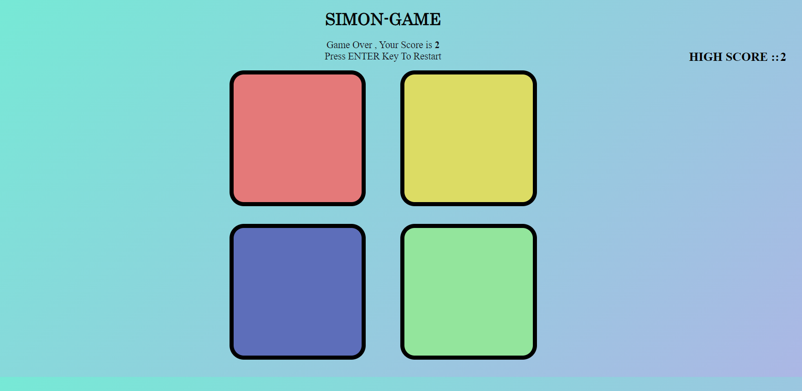

# Simon Game

This project is a web-based implementation of the classic Simon game using HTML, CSS, and JavaScript.

## Features

- **Gameplay**: Test your memory by following the sequence of colors generated by the computer.
- **Levels**: Each successful round increases the difficulty level.
- **High Score**: Tracks and displays the highest level achieved in the session.

## Getting Started

To play the game:

1. Clone the repository: `git clone <repository-url>`
2. Open `index.html` in your web browser.
3. Press `ENTER` Simon Game

This project is a web-based implementation of the classic Simon game using HTML, CSS, and JavaScript.

## Features

- **Gameplay**: Test your memory by following the sequence of colors generated by the computer.
- **Levels**: Each successful round increases the difficulty level.
- **High Score**: Tracks and displays the highest level achieved in the session.

## Getting Started

To play the game:

1. Clone the repository: `git clone <repository-url>`
2. Open `index.html` in your web browser.
3. Press `ENTER` key to start the game.
4. Follow the sequence of colors flashed by clicking on the corresponding colored boxes.
5. If you make a mistake, the game will end and display your score.

## Screenshot

## Contributing

Contributions are welcome! Here are a few ways you can contribute:

- Enhance the user interface.
- Improve game logic or add new features.
- Fix bugs and optimize code.

